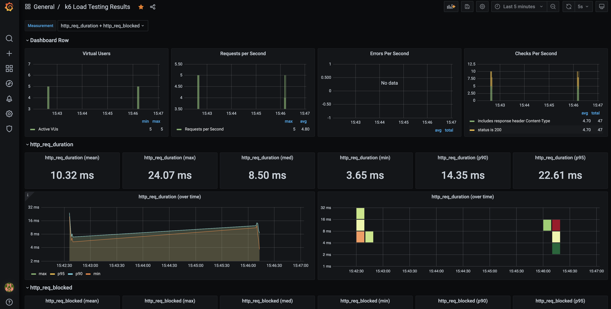

# TypeScript with k6


This repository showcases k6 with typescript and generating boilerplate scripts from your OAS (Open API Spec). k6 recently outlined in thoughtworks [tech radar](https://www.thoughtworks.com/radar/tools?blipid=202010078) tools quadrant.


- [TypeScript with k6](#typescript-with-k6)
  - [Prerequisites](#prerequisites)
  - [Installation](#installation)
    - [Install dependencies](#install-dependencies)
  - [Usage/Examples](#usageexamples)
    - [Running the test](#running-the-test)
    - [OAS integration](#oas-integration)
      - [Test running against the API](#test-running-against-the-api)
    - [OAuth2 integration](#oauth2-integration)
    - [Load testing with influxdb and grafana](#load-testing-with-influxdb-and-grafana)
  - [Resources](#resources)
  - [TODO](#todo)

## Prerequisites

- [k6](https://k6.io/docs/getting-started/installation)
- [NodeJS](https://nodejs.org/en/download/)
- [Yarn](https://yarnpkg.com/getting-started/install)
- [Docker](https://docs.docker.com/get-docker/)

## Installation

### Install dependencies

Clone the generated repository on your local machine, move to the project root folder and install the dependencies defined in [`package.json`](./package.json)

```bash
yarn
```

## Usage/Examples

### Running the test

To run a test written in TypeScript, we first have to transpile the TypeScript code into JavaScript and bundle the project

```bash
yarn webpack
```

This command creates the final test files to the `./dist` folder.

Once that is done, we can run our script the same way we usually do, for instance:

```bash
k6 run dist/test1.js
```

### OAS integration

> Showcase gen k6 script from OAS (Open API Spec)

Generate k6s scripts via [open api generator](https://openapi-generator.tech/docs/generators/#client-generators) and the [oas file](oas3.yaml). Can run the CLI via the docker image.

```bash
docker pull openapitools/openapi-generator-cli

docker run --rm -v ${PWD}:/local openapitools/openapi-generator-cli generate \
    -i /local/oas3.yaml \
    -g k6 \
    -o /local/k6-oas3/ \
    --skip-validate-spec

```

This generates [script.js](./k6-oas3/script.js) and is a great start to help support defining your perf test cases.

**NB** It is boilerplate so will need to be refined after for re-use

This auto-generation of the load test script will help streamline the API testing process, keeping on par with the latest changes to their APIs and specifications.

#### Test running against the API

```bash
docker run -d -p8090:8081 shanelee007/greetings-api:latest #run greetings API
yarn webpack
k6 run -e BASE_URL=http://localhost:8090 dist/greetings.js
yarn html #generate a html report
```

### OAuth2 integration

> Showcase gen types from open api generator and k6 scripts for [bpay API](./bpay/oas3.yaml)

- Generate typescript client sdk (for types)
- Generate k6 scripts from OAS

```bash
# gen client sdk from OAS using generator typescript
docker run --rm -v ${PWD}:/local openapitools/openapi-generator-cli generate \
    -i /local/bpay/oas3.yaml \
    -g typescript \
    -o /local/bpay/bpay-client/ \
    --additional-properties=supportsES6=true,platform=node \
    --skip-validate-spec

# gen k6 scripts
docker run --rm -v ${PWD}:/local openapitools/openapi-generator-cli generate \
    -i /local/bpay/oas3.yaml \
    -g k6 \
    -o /local/bpay/k6/ \
    --skip-validate-spec

#run load test against bpay api
yarn webpack
CLIENT_ID=REDACTED CLIENT_SECRET=REDACTED k6 run dist/bpay.js
```

### Load testing with influxdb and grafana

```bash
docker compose up -d #run the services in the background
docker-compose run -v \
    $PWD/dist:/scripts \
    k6 run -e BASE_URL=http://host.docker.internal:8090  /scripts/greetings.js

```

Access grafana: `open http://localhost:3000` and verify connection to influxdb datasource. Access the pre-defined dashboard and set interval to the past 5 mins. You should see similar outline to below



## Resources

- [k6 and oas](https://k6.io/blog/load-testing-your-api-with-swagger-openapi-and-k6/)
- [k6 vs jmeter](https://k6.io/blog/k6-vs-jmeter/)
- [prettier pre-commit](https://prettier.io/docs/en/precommit.html)

## TODO

- raise issue on stdout chars
- showcase browser recorder
