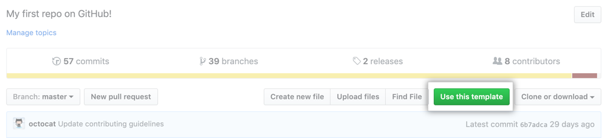

<div align="center">

  

# TypeScript with k6


</div>

This repository provides a scaffolding project to start using TypeScript in your k6 scripts.

## Prerequisites

- [k6](https://k6.io/docs/getting-started/installation)
- [NodeJS](https://nodejs.org/en/download/)
- [Yarn](https://yarnpkg.com/getting-started/install) (optional)
- [Docker](https://docs.docker.com/get-docker/)

## Installation

### Creating a project from the `template-typescript` template**

To generate a TypeScript project that includes the dependencies and initial configuration, navigate to the [template-typescript](https://github.com/k6io/template-typescript) page and click **Use this template**.

  

### Install dependencies

Clone the generated repository on your local machine, move to the project root folder and install the dependencies defined in [`package.json`](./package.json)

```bash
yarn
```

## Running the test

To run a test written in TypeScript, we first have to transpile the TypeScript code into JavaScript and bundle the project

```bash
yarn webpack
```

This command creates the final test files to the `./dist` folder.

Once that is done, we can run our script the same way we usually do, for instance:

```bash
k6 run dist/test1.js
```

## OAS integration

> Showcase gen k6 script from OAS

```bash
docker pull openapitools/openapi-generator-cli

docker run --rm -v ${PWD}:/local openapitools/openapi-generator-cli generate \
    -i /local/oas3.yaml \
    -g k6 \
    -o /local/k6-test/ \
    --skip-validate-spec

```

This generates `scripts.js` is a great start to help support defining your perf test cases.

**NB** It is boilerplate so will need to be cleaned up after for re-use

This auto-generation of the load test script will help streamline the API testing process, keeping on par with the latest changes to their APIs and specifications.

```bash
docker run --rm -it -p8090:8081 shanelee007/greetings-api:latest #run greetings API
yarn webpack
k6 run dist/greetings.js
yarn html #gen html report
```

## Resources

- [k6 and oas](https://k6.io/blog/load-testing-your-api-with-swagger-openapi-and-k6/)

## TODO

- add in prettify
- raise issue on stdout chars
